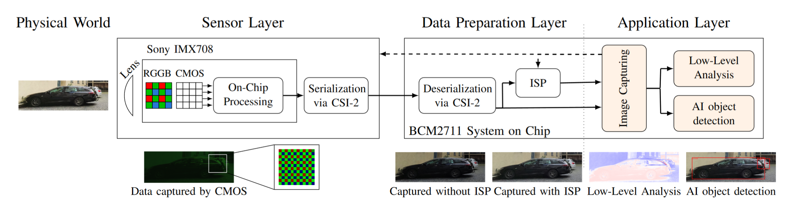

# PICT (PICT is an Image Capture Testbed)

This testbed belongs to our work **SoK: Security of the Image Processing Pipeline in Autonomous Vehicles**, where we bridge the research on security and robustness of the image processing pipeline for autonomous vehicles. This pipeline consists of multiple layers (see below), which can be configured and analyzed with this testbed.



This image sensor testbed contains multiple tools to capture, analyze and work with raw images ([DNG format](https://en.wikipedia.org/wiki/Digital_Negative)) and processed images. This test bed was tested with the following setup:

* [Raspberry Pi 4 (4GB Memory)](https://www.raspberrypi.com/products/raspberry-pi-4-model-b/)
* [Camera Module 3 Wide](https://www.raspberrypi.com/documentation/accessories/camera.html)
* [Raspberry Pi OS](https://www.raspberrypi.com/software/)

The following sections highlight the individual tools

## `camWrapper.py`

This tool allows to captur images with manual settings. It acts as a wrapper of the [`rpicam` toolchain](https://www.raspberrypi.com/documentation/computers/camera_software.html#rpicam-still).

### Dependencies
* Python 3.11
    * Tkinter (`pip install tk`)
    * Pillow (`pip install pillow`)
    * ImageTk (`sudo apt-get install python-imaging-tk`)
    * tkinter-tooltip (`pip install tkinter-tooltip`)
* [`rpicam` apps](https://www.raspberrypi.com/documentation/computers/camera_software.html#rpicam-apps)

### Run
* Adjust the parameters with GUI: Start the camera wrapper via `python camWrapper.py`
    * Adjust you camera settings (lower right corner)
    * Click _"Capture Preview"_ to capture a (jpeg-only) preview with the current settings
    * Click _"Capture measurement"_ to capture both a raw and a high-quality JPEG image with the current settings. This will additionally store a txt file with the specified parameters.
* Run the tool automated w/o GUI but providing of a text-based [config file](https://www.raspberrypi.com/documentation/computers/camera_software.html#configuration): `python camWrapper.py <path/to/config.txt>`
    * Define the camera parameters as [specified online](https://www.raspberrypi.com/documentation/computers/camera_software.html#configuration)
    * Execute the tool to create a measurement

### FAQ
* How can I reset the parameters in the GUI?
    * For text fields / sliders: Move your mouse over the desired field and follow the instructions of the tool tip
    * For selection fields: Select the first entry in the list
    * **Please note:** The text fields must not be emtpy

## `imageComparison.py`

This tool allows to compare two images. It will both calculate comparison metrics and provide a visualization of the results. Addtionally, it allows cropping to investigate only the region of interest (ROI). _For JPEG images only:_ Since the analysis is done for each color channel, you can toggle the different viewing options with a _double right-click_ to a blank area in the displayed graphs.

### Dependencies
* Python 3.11
    * Rawpy (`pip install rawpy`)
    * Matplotlib (`pip install matplotlib`)
    * Numpy (`pip install numpy`)
    * Pillow (`pip install pillow`)

### Run
General syntax of the tool:

```bash
python imageComparison.py <image 1> <image 2> [<x1,y1> <x2,y2>]
```

* `image 1` is a file path to the first image (=reference image). It can be a raw image in the [DNG format](https://en.wikipedia.org/wiki/Digital_Negative) or a JPEG image. Example: `measurements/image1.dng`
* `image 2` is a file path to the second image (=comparison image). It can be a raw image in the [DNG format](https://en.wikipedia.org/wiki/Digital_Negative) or a JPEG image. Example: `measurements/image2.dng`
* _Optionally_ the tool can directly analyze only the ROI
    * `<x1,y1>` is the upper left corner for the ROI. Example: `100,100`
    * `<x2,y2>` is the lower right corner for the ROI. Example: `201,201`

### FAQ
* The tool complains, that my ROI is not working
    * Make sure, that the ROI follows the [Bayer pattern](https://en.wikipedia.org/wiki/Bayer_filter), e.g., the upper left corner will have only even coordinates and the lower right corner will have only odd coordinates.

## `imageDetection.py`

This tool represents the functionality of a object detection algorithm in the application layer. Addtionally, it allows cropping to investigate only the region of interest (ROI)

### Dependencies
* Python 3.11
    * PyTorch (see [https://pytorch.org/get-started/locally/](https://pytorch.org/get-started/locally/))
    * Rawpy (`pip install rawpy`)

### Run
General syntax of the tool:

```bash
python imageDetection.py <image> [<x1,y1> <x2,y2>]
```

* `image` is a file path to the image to analyze. Example: `measurements/image1.jpg`
* _Optionally_ the tool can directly analyze only the ROI
    * `<x1,y1>` is the upper left corner for the ROI. Example: `100,100`
    * `<x2,y2>` is the lower right corner for the ROI. Example: `201,201`

### FAQ
* The tool complains, that my ROI is not working
    * Make sure, that the ROI follows the [Bayer pattern](https://en.wikipedia.org/wiki/Bayer_filter), e.g., the upper left corner will have only even coordinates and the lower right corner will have only odd coordinates.