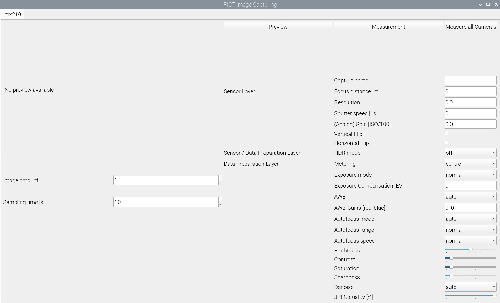

Tools:
* [PICT](#pict-pict-is-an-image-capture-testbed)
* [TARA-CAM](#tara-cam-threat-analysis-and-risk-assessment-for-automotive-cameras)

# PICT (PICT is an Image Capture Testbed)

This testbed belongs to our work **SoK: Security of the Image Processing Pipeline in Autonomous Vehicles**, where we bridge the research on security and robustness of the image processing pipeline for autonomous vehicles. This pipeline consists of multiple layers (see below), which can be configured and analyzed with this testbed.


This image sensor testbed contains multiple tools to capture, analyze and work with raw images ([DNG format](https://en.wikipedia.org/wiki/Digital_Negative)) and processed images. This test bed was tested with the following setup:

* [Raspberry Pi 4 (4GB Memory)](https://www.raspberrypi.com/products/raspberry-pi-4-model-b/)
* [Camera Module 3 Wide](https://www.raspberrypi.com/documentation/accessories/camera.html)
* [Raspberry Pi OS](https://www.raspberrypi.com/software/)

The following sections highlight the individual tools.

## `imageCapturing.py`
This tool allows to capture images with manual settings. It offers both a GUI and a command line interface.

### Dependencies
* Python 3.11
    * PyQt6 (`pip install PyQt6`)
    * Picamera2 (`pip install picamera2==0.2.2`)
    * [`rpicam` apps](https://www.raspberrypi.com/documentation/computers/camera_software.html#rpicam-apps) (only for dynamic preview)

### Run GUI
Start the tool by calling `python imageCapturing.py`. There will be one tab for each connected camera.



Description of the GUI:

* Camera settings: All parameters on the right side of the GUI can be freely configured. Their applicability might be dependent on the used hardware. If a setting is not available in the given hardware setup it will not be applied
* Automated capturing: Definition of the amount of images and their sampling time. _Please Note:_ This is set per camera.
* Capturing:
    * Preview: Capture a post-ISP preview image with the currently selected settings. This image will be overwritten/deleted on each click/once the application is terminated.
    * Measurement: Capture both a pre- and post-ISP image with the currently selected settings, together with a text file containing details on the captured data. _Please Note:_ Pre-ISP images are only for MIPI CSI-2 cameras.
    * Measure all Cameras: Capture both a pre- and post-ISP image with the currently selected settings, together with a text file containing details on the captured data for each connected camera. _Please Note:_ Pre-ISP images are only for MIPI CSI-2 cameras.
    * Preview Window: A long left-click (>2s) shows a live stream of the selected camera without capturing data. _Please Note:_ For performance-reasons this will only show a preview with the default settings

### Run command line interface

General syntax of the tool:

```bash
python imageCapturing.py <config file>[,<config file>]
```

Requires a pre-defined camera configuration file (example for the [Camera Module 3 Wide](https://www.raspberrypi.com/documentation/accessories/camera.html) is in the [config subfolder](/config/)) and captures all specified cameras. Multiple config files are passed comma-separated.

_Please Note:_ The config files must be in the order of the connected cameras. To identify the order, please run `python imageCapturing.py --list-cameras`. This will show you the expected order of the config files to be provided. If less config files are provided, only the first cameras are captured.

### FAQ
* How can I reset the parameters in the GUI?
    * For text fields / sliders: Move your mouse over the desired field and follow the instructions of the tool tip
    * For selection fields: Select the first entry in the list
    * **Please note:** The text fields must not be emtpy
* I face stability issues when trying to capture images.
    * An increase of the CMA memory inside the Raspberry Pi might be necessary. Please refer to the official Picamera2 documentation: https://datasheets.raspberrypi.com/camera/picamera2-manual.pdf#cma-memory

## `imageComparison.py`

This tool allows to compare two images. It will both calculate comparison metrics and provide a visualization of the results. Addtionally, it allows cropping to investigate only the region of interest (ROI). _For JPEG images only:_ Since the analysis is done for each color channel, you can toggle the different viewing options with a _double right-click_ to a blank area in the displayed graphs.

### Dependencies
* Python 3.11
    * Rawpy (`pip install rawpy`)
    * Matplotlib (`pip install matplotlib`)
    * Numpy (`pip install numpy`)
    * Pillow (`pip install pillow`)

### Run
General syntax of the tool:

```bash
python imageComparison.py <image 1> <image 2> [<x1,y1> <x2,y2>]
```

* `image 1` is a file path to the first image (=reference image). It can be a raw image in the [DNG format](https://en.wikipedia.org/wiki/Digital_Negative) or a JPEG image. Example: `measurements/image1.dng`
* `image 2` is a file path to the second image (=comparison image). It can be a raw image in the [DNG format](https://en.wikipedia.org/wiki/Digital_Negative) or a JPEG image. Example: `measurements/image2.dng`
* _Optionally_ the tool can directly analyze only the ROI
    * `<x1,y1>` is the upper left corner for the ROI. Example: `100,100`
    * `<x2,y2>` is the lower right corner for the ROI. Example: `201,201`

### FAQ
* The tool complains, that my ROI is not working
    * Make sure, that the ROI follows the [Bayer pattern](https://en.wikipedia.org/wiki/Bayer_filter), e.g., the upper left corner will have only even coordinates and the lower right corner will have only odd coordinates.

## `imageDetection.py`

This tool represents the functionality of a object detection algorithm in the application layer. Addtionally, it allows cropping to investigate only the region of interest (ROI)

### Dependencies
* Python 3.11
    * PyTorch (see [https://pytorch.org/get-started/locally/](https://pytorch.org/get-started/locally/))
    * Rawpy (`pip install rawpy`)

### Run
General syntax of the tool:

```bash
python imageDetection.py <image> [<x1,y1> <x2,y2>]
```

* `image` is a file path to the image to analyze. Example: `measurements/image1.jpg`
* _Optionally_ the tool can directly analyze only the ROI
    * `<x1,y1>` is the upper left corner for the ROI. Example: `100,100`
    * `<x2,y2>` is the lower right corner for the ROI. Example: `201,201`

### FAQ
* The tool complains, that my ROI is not working
    * Make sure, that the ROI follows the [Bayer pattern](https://en.wikipedia.org/wiki/Bayer_filter), e.g., the upper left corner will have only even coordinates and the lower right corner will have only odd coordinates.

# TARA-CAM (Threat Analysis and Risk Assessment for automotive CAMeras)

In addition to [PICT](#pict-pict-is-an-image-capture-testbed), we provide [TARA-CAM](https://tum-esi.github.io/PICT/), a tool about Threat Analysis and Risk Assessment for automotive CAMeras. It is an interactive online tool, that is accessible through a separate [homepage](https://tum-esi.github.io/PICT/). TARA-CAM supports the threat analysis and risk assessment according to ISO 21434, an automotive cyber-security standard.

The analysis of new attacks is possible by entering the respective parameters in the top. By submitting the results, the analysis is sent for review. This allows new attacks to be added persistently to the database.